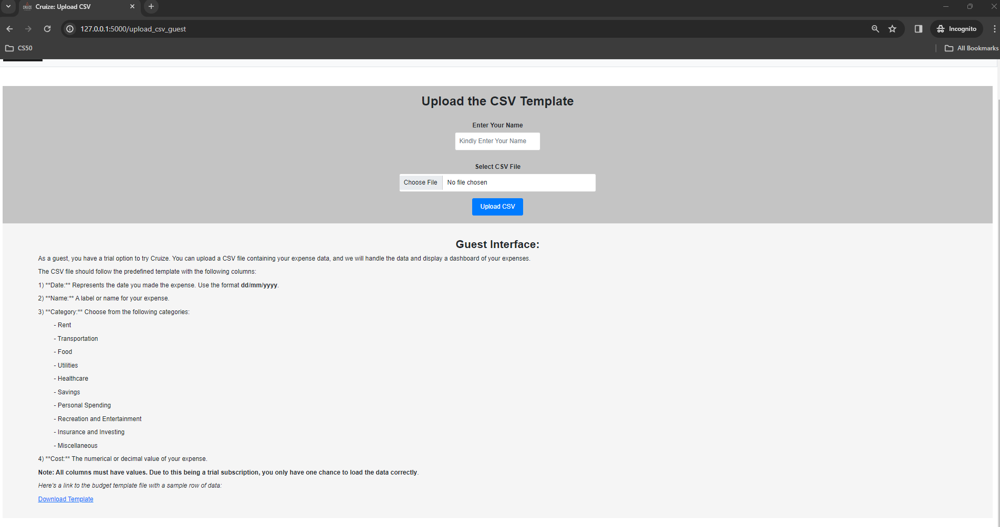
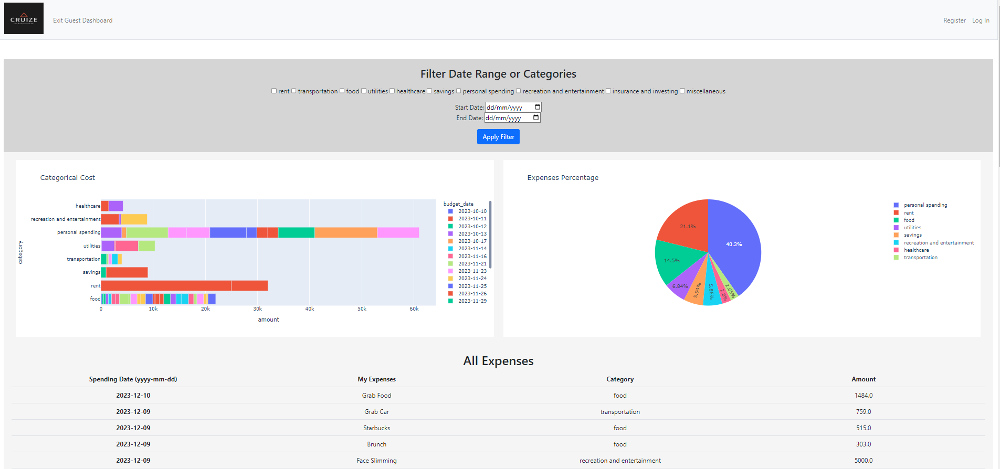
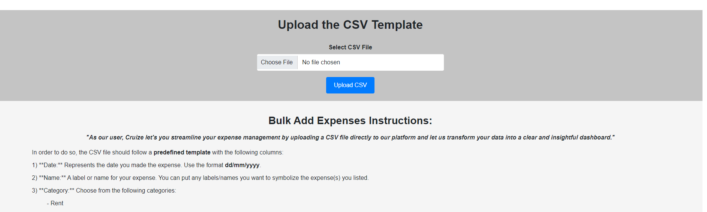
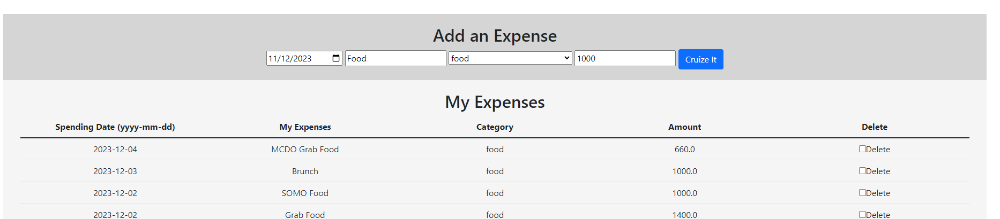
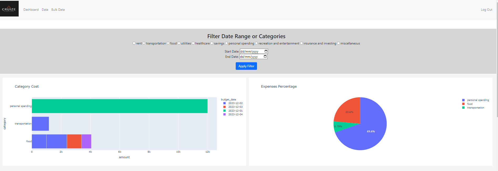
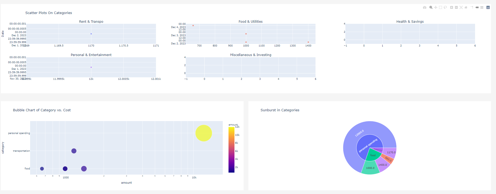
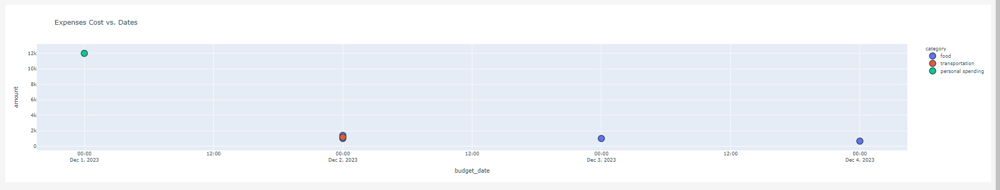
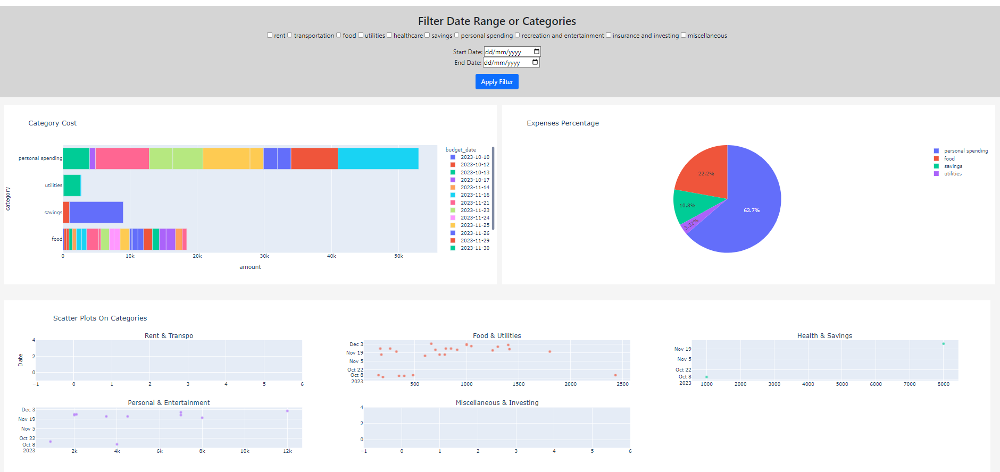
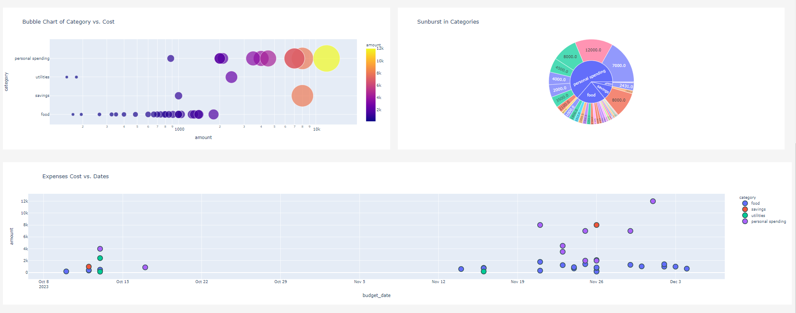

# CRUIZE: Your Budgeting Buddy


     

## Installation
Use the package manager [pip](https://pip.pypa.io/en/stable/) to install libraries such as flask, pandas, plotly and cs50 sqlite

```bash
pip install cs50 flask pandas plot plotly-express
```
## Overview
Cruize: Your Budgeting Buddy is a web application designed to assist users in tracking their financial expenses through engaging visualizations such as charts and dashboards. The application caters to both guest and member users, each offering unique levels of functionality.

### Guest Access
Guests are granted limited access to the platform. Upon selecting 'Continue as a Guest' on the login page, they are directed to a page where they can upload their expense data. This involves providing a username and selecting a CSV file that adheres to predefined columns - date, name, category, and cost. A sample CSV file is available for download through a provided Google Drive link.

https://drive.google.com/file/d/18kanlS7lVHZ6_YIl8j0VaHuoxuw5vJOx/view

Expense categories include rent, transportation, food, utilities, healthcare, savings, personal spending, recreation and entertainment, insurance and investing, and miscellaneous. It is crucial for guests to choose from these categories to ensure a smooth upload process. Following a successful upload, a dashboard is generated, presenting the user's expenses in a tabular format. Exiting the guest page results in the deletion of all guest data, including any generated dashboards.

| Guest Initial Page |
|:-------------------:|
||

| Guest Dashboard |
|:-------------------:|
||

### Member Access

Members are afforded two options for uploading data – manual entry or utilizing the template introduced to guests. Data belonging to members is always saved, with the provision to delete specific records at their discretion. The member's expense table can be sorted by column, and a dedicated page showcases all dashboards and charts.

| Bulk Add | Manual Add |
| :---: | :---: |
|   | |

Member's homepage will default to current month for the date range and categories to all.

| Homepage1 | Homepage2 | Homepage3  |
| :---: | :---: | :---: |
|   | | |

Using Date Range (October 1 to December 31, 2023)
| Date Range and Category Filter |
|:-------------------:|
||

| Date Range and Category Filter |
|:-------------------:|
||

### Dashboard Filters
Both guests and members have the ability to filter data based on date range (start and end date) and specific categories. Opting not to select any categories defaults to displaying all categories. The application ensures a seamless and error-free experience when handling expense data.

## Contribution

Your contributions will be greatly appreciated! Kindly refer to the [contribution guidelines](CONTRIBUTING.md) :tada:

## Licenses
This is part of CS50x course final project. Logo is a paid designd from Wix.


